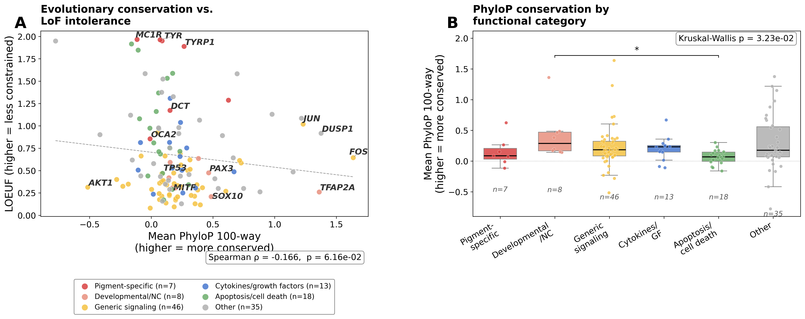
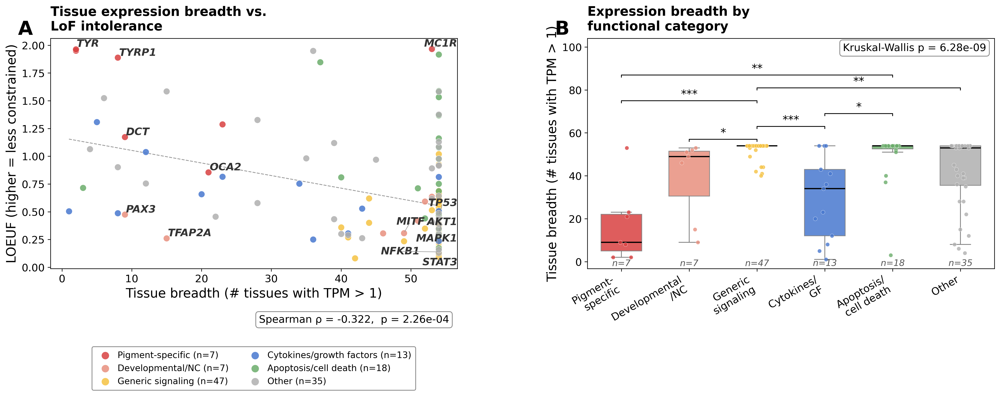

## Overview

Phase 1 adds two independent constraint axes to the network analysis:

- **Phase 1.1 — PhyloP:** Mean vertebrate conservation score (100-way, hg38) per gene,
  fetched from UCSC. Tests whether functional categories differ in evolutionary conservation.
- **Phase 1.2 — GTEx:** Tissue expression breadth (number of tissues with median TPM > 1,
  GTEx v8, 54 tissues). Tests Hypothesis 2: broadly expressed genes show stronger constraint.

Both metrics are merged with the Raghunath 129-gene LOEUF dataset in:

- `data/network_constraint_phylop.csv`
- `data/network_constraint_gtex.csv`

---

## Phase 1.1 — PhyloP evolutionary conservation

```{python}
#| echo: false
#| warning: false
import pandas as pd
import numpy as np
from scipy import stats
import warnings
warnings.filterwarnings('ignore')

phylop = pd.read_csv('data/network_constraint_phylop.csv')
df = phylop.dropna(subset=['mean_phylop_100way', 'LOEUF'])

rho, pval = stats.spearmanr(df['mean_phylop_100way'], df['LOEUF'])

CATEGORY_ORDER = [
    'Pigment-specific', 'Developmental/NC', 'Generic signaling',
    'Cytokines/growth factors', 'Apoptosis/cell death', 'Other',
]
groups = [df.loc[df['functional_category'] == c, 'mean_phylop_100way'].values
          for c in CATEGORY_ORDER]
kw_stat, kw_p = stats.kruskal(*[g for g in groups if len(g) > 0])
```

**Spearman ρ(PhyloP, LOEUF) = `{python} f"{rho:.3f}"`**, p = `{python} f"{pval:.3e}"` —
genes with higher PhyloP conservation scores tend to be more LoF-intolerant (lower LOEUF),
consistent with both metrics capturing evolutionary constraint. The Kruskal-Wallis test
across functional categories is significant (p = `{python} f"{kw_p:.3e}"`), with
Developmental/NC genes most conserved and Pigment-specific genes least conserved.

{width=100%}

### Key genes

```{python}
#| echo: false
key_genes = ['TYR', 'TYRP1', 'DCT', 'OCA2', 'MC1R', 'SOX10', 'PAX3', 'MITF', 'TFAP2A']
(phylop[phylop['gene'].isin(key_genes)]
 [['gene', 'functional_category', 'LOEUF', 'mean_phylop_100way']]
 .sort_values('mean_phylop_100way', ascending=False)
 .rename(columns={'mean_phylop_100way': 'Mean PhyloP 100-way'})
 .reset_index(drop=True))
```

### PhyloP summary by functional category

```{python}
#| echo: false
summary = (df.groupby('functional_category')['mean_phylop_100way']
           .agg(['count', 'median', 'mean'])
           .round(3)
           .rename(columns={'count': 'N', 'median': 'Median PhyloP', 'mean': 'Mean PhyloP'}))
summary.loc[[c for c in CATEGORY_ORDER if c in summary.index]]
```

---

## Phase 1.2 — GTEx tissue expression breadth

```{python}
#| echo: false
gtex = pd.read_csv('data/network_constraint_gtex.csv')
df_g = gtex.dropna(subset=['tissue_breadth', 'LOEUF'])

rho_g, pval_g = stats.spearmanr(df_g['tissue_breadth'], df_g['LOEUF'])
groups_g = [df_g.loc[df_g['functional_category'] == c, 'tissue_breadth'].values
            for c in CATEGORY_ORDER]
kw_stat_g, kw_p_g = stats.kruskal(*[g for g in groups_g if len(g) > 0])
```

**Spearman ρ(tissue breadth, LOEUF) = `{python} f"{rho_g:.3f}"`**,
p = `{python} f"{pval_g:.3e}"` — the strongest constraint signal in Phase 1.
Genes expressed broadly across tissues are far more LoF-intolerant than
tissue-specific genes. The Kruskal-Wallis test is highly significant
(p = `{python} f"{kw_p_g:.3e}"`).

{width=100%}

### Hypothesis 2 test — Regression: LOEUF ~ tissue breadth + functional category

```{python}
#| echo: false
import statsmodels.formula.api as smf

model = smf.ols(
    'LOEUF ~ tissue_breadth + C(functional_category, Treatment("Pigment-specific"))',
    data=df_g).fit()
model.summary().tables[1]
```

After controlling for functional category, tissue breadth remains a significant
predictor of LOEUF (see `tissue_breadth` coefficient above). Pigment-specific
genes are used as the reference category.

### Tissue breadth summary by functional category

```{python}
#| echo: false
summary_g = (df_g.groupby('functional_category')['tissue_breadth']
             .agg(['count', 'median', 'mean'])
             .round(1)
             .rename(columns={'count': 'N', 'median': 'Median breadth',
                              'mean': 'Mean breadth'}))
summary_g.loc[[c for c in CATEGORY_ORDER if c in summary_g.index]]
```

---

## Data provenance

| File | Description | Source |
|------|-------------|--------|
| `data/phylop_scores.csv` | Mean PhyloP 100-way per gene (hg38) | UCSC REST API via `analysis/fetch_phylop_scores.py` |
| `data/GTEx_v8_gene_median_tpm.gct.gz` | GTEx v8 median TPM, 54 tissues | GTEx Portal (auto-downloaded) |
| `data/network_constraint_phylop.csv` | LOEUF + PhyloP merged | `analysis/phase1_phylop_analysis.py` |
| `data/network_constraint_gtex.csv` | LOEUF + tissue breadth merged | `analysis/phase1_gtex_analysis.py` |
